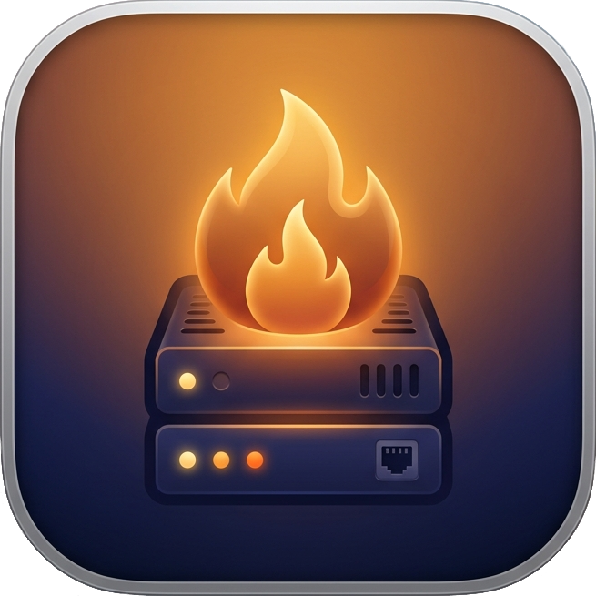

<div align="center">



### A native macOS local development environment for PHP & Node.js

Run local sites at **`https://your-project.test`** with trusted HTTPS, automatic `.test` domains, databases, a built-in database editor, a unified developer CLI, an AI Agent MCP server, mail testing, logs, and public sharing, from a single native menu-bar app. No Docker.

**Open-source. Free forever.** An alternative to Laravel Herd, ServBay, Valet, and Laragon for macOS.

[](https://github.com/KTStackAPP/KTStack/releases)
[](https://github.com/KTStackAPP/KTStack/releases)
[](https://github.com/KTStackAPP/KTStack/stargazers)


[](LICENSE)


</div>

---

## Why KTStack?

Setting up a local PHP/Node stack on macOS usually means stitching together a web server, a PHP version manager, database engines, local HTTPS certificates, DNS config, a mail catcher, and a database GUI.

KTStack bundles all of it into one native app. Create a site and instantly get:

```
https://my-project.test
```

It comes with HTTPS, the right PHP version, databases, logs and mail testing already wired up.

The features other tools **lock behind a paid plan or a separate app** (the database editor, every database engine, mail testing, public sharing) are **built in and free** here.

## Features

Everything in KTStack is built-in, 100% free, and open-source (MIT)—no Pro tiers, no subscriptions, no paywalls:

- **Automatic `.test` Domains & Local HTTPS**: Trusted SSL certificates minted by a local CA with automatic DNS loopback resolution.
- **Isolated PHP & Node.js Runtimes**: PHP 7.4 through 8.5 with independent `php.ini`, extensions, Xdebug, and Node.js 20/22/24/26.
- **Zero Runtime Dependencies**: Lightweight native macOS app—no Docker or Homebrew required.
- **Built-in Database Engines**: One-click supervision for MySQL 9.6, MariaDB 10.11/11.4, PostgreSQL 17, Redis 7.4, Memcached 1.6, and MongoDB 7.
- **Full Database Management Workspace**: Browse and edit rows, execute SQL, inspect DDL/schemas, navigate foreign keys, and explain plans (MySQL, MariaDB, Postgres, SQLite, Mongo).
- **1-Click Database Backup & Restore**: Snapshot dumps and restores for MySQL, PostgreSQL, and SQLite without external tools.
- **AI Coding Agent MCP Server (`kt mcp`)**: Built-in Model Context Protocol server over stdio for Cursor, Claude Code, and Windsurf to manage sites, switch PHP versions, trigger backups, and query logs.
- **Unified Developer CLI (`kt`)**: Fast terminal tool communicating via private Unix domain socket (`kt sites`, `kt services`, `kt db`, `kt doctor`).
- **1-Click IDE Quick Launch**: Instantly open projects from Site Cards into Cursor, VS Code, PhpStorm, Zed, or Sublime Text.
- **Mail Testing (Mailpit)**: Embedded SMTP server and HTML email inspector.
- **Proxy Sites**: Point any `.test` domain to a local port, LAN host, or remote HTTPS origin.
- **Per-Site Customization**: Custom alias domains, environment variables, and validated Nginx configuration directives.
- **Live Multi-Source Log Viewer**: Stream Nginx access/error logs, PHP-FPM logs, and service output in real time.
- **`dd()` / `dump()` Stream Viewer**: Laravel and Symfony dumps stream straight into the app with zero code setup.
- **Cloudflare Tunnel Sharing**: Expose local sites over temporary public HTTPS URLs for client reviews and mobile testing.
- **Configurable TLD**: Customize your local top-level domain beyond `.test`.
- **Apple Silicon & Intel Mac Support**: Native universal builds for both `arm64` and `x86_64` on macOS 13+.
- **Native macOS Liquid Glass UI**: Modern SwiftUI interface supporting macOS 27+ Liquid Glass with macOS 13+ material fallback, and Sparkle auto-updates.
## Screenshots

| Sites | Services | Runtimes |
|---|---|---|
|  |  |  |

<div align="center"></div>

## Install

1. Download the latest DMG from the [**Releases**](https://github.com/KTStackAPP/KTStack/releases) page:
   - **Apple Silicon (M1/M2/M3/M4/M5)**: `KTStack-<version>-arm64.dmg`
   - **Intel Mac**: `KTStack-<version>-x86_64.dmg`
2. Drag **KTStack** to Applications and launch it.
3. Approve the privileged helper when prompted (needed only for local DNS, the `/etc/resolver` entry, and installing the local HTTPS CA).
4. Add a site, open `https://<name>.test`. Done.
5. *(Optional)* Install the CLI helper: Open **Settings → General → Install CLI Helper** to make `kt` globally available in your terminal.

Requires **macOS 13 (Ventura) or newer**, on Apple Silicon (`arm64`) or Intel (`x86_64`).


## AI Agent Integration (MCP Server)

KTStack includes a built-in **Model Context Protocol (MCP)** server (`kt mcp`) that communicates over stdio JSON-RPC 2.0. This allows AI coding agents in Cursor, Claude Code, Windsurf, or Roo Code to inspect and modify your local development environment with zero network latency.

### Cursor Configuration (`.cursor/mcp.json` or Global MCP Settings)
```json
{
  "mcpServers": {
    "ktstack": {
      "command": "kt",
      "args": ["mcp"]
    }
  }
}
```

### Claude Code / Claude Desktop Configuration (`claude_desktop_config.json`)
```json
{
  "mcpServers": {
    "ktstack": {
      "command": "/usr/local/bin/kt",
      "args": ["mcp"]
    }
  }
}
```

### Exposed MCP Tools
- `ktstack_list_sites`: List all local sites, domains, PHP/Node versions, backend ports, and TLS statuses.
- `ktstack_create_site`: Provision a new local site with automatic `.test` domain and TLS.
- `ktstack_switch_php_version`: Change the assigned PHP runtime (7.4 through 8.5) for any site.
- `ktstack_inspect_db_schema`: Inspect tables, columns, indexes, and primary keys across MySQL, Postgres, and SQLite.
- `ktstack_backup_db`: Export a compressed snapshot dump of a site's database.
- `ktstack_restore_db`: Restore a SQL dump into a database.
- `ktstack_get_recent_logs`: Fetch recent access/error log entries for instant troubleshooting.

---

## Developer CLI (`kt`)

KTStack ships with a lightweight, native command-line tool `kt` communicating directly with the background app over a private Unix domain socket (`ktstack.sock`):

```bash
# List registered sites (or output structured JSON for scripts)
kt sites list
kt sites list --json

# Register a new local site
kt sites create --name my-app --path ~/Sites/my-app --php 8.4

# Manage database & cache services
kt services status
kt services start mysql
kt services stop redis

# Trigger a database backup
kt db backup my-app
kt db backup my-app --out ~/Backups/my-app.sql

# Run environment health diagnostics
kt doctor

# Start the Model Context Protocol stdio server
kt mcp
```
## How it works

```
browser → https://app.test
  → dnsmasq           resolves *.test → 127.0.0.1   (privileged helper, root)
  → Nginx (:80/:443)  reverse proxy + local TLS     (user launch agent)
  → PHP-FPM / Node    per-site, version-aware
```

The root helper does **only** three things, write `/etc/resolver/<tld>`, run dnsmasq on port 53, and install the local CA into the System Keychain. Everything else (Nginx, PHP-FPM, databases) runs as your user. All app data lives in `~/Library/Application Support/KTStack/`.

## Build from source

The Xcode project is generated by [XcodeGen](https://github.com/yonaskolb/XcodeGen), `project.yml` is the source of truth; never edit `KTStack.xcodeproj` by hand.

```bash
brew install xcodegen
xcodegen generate

# Run the framework logic tests
xcodebuild -project KTStack.xcodeproj -scheme KTStackKit-Tests -destination 'platform=macOS' test

# Build a Release app
xcodebuild -project KTStack.xcodeproj -scheme KTStack -destination 'platform=macOS' -configuration Release build

# Or run the whole gate (lint + tests + Release build); --quick drops the build
scripts/ci-local.sh

# Enforce the quick gate (lint + tests) on commit and push
scripts/install-git-hooks.sh

# Boot a real nginx/php-fpm stack from the generated configs and assert over HTTP(S)
# (needs the bundled binaries below; too slow for the hooks, run per session and before merges)
scripts/integration-test.sh
```

> Bundled binaries under `KTStack/Resources/bin/` (nginx, dnsmasq, mkcert, redis, mailpit, …) are gitignored build artifacts produced by `scripts/build-*-relocatable.sh`; they won't exist on a fresh checkout until built. See `docs/` for architecture and the signing/notarization guide.

## Contributing

Issues and pull requests are welcome. KTStack is an active project exploring Swift, SwiftUI, macOS development and developer-experience tooling.

## Contributors

Thanks to everyone who contributes to KTStack.

<a href="https://github.com/KTStackAPP/KTStack/graphs/contributors">
  
</a>

## License

KTStack is free and open-source software. See [`LICENSE`](LICENSE).

---

<div align="center">

**⭐ If KTStack helps your workflow, please star the repo, it's the single biggest thing that helps others find it.**

</div>
