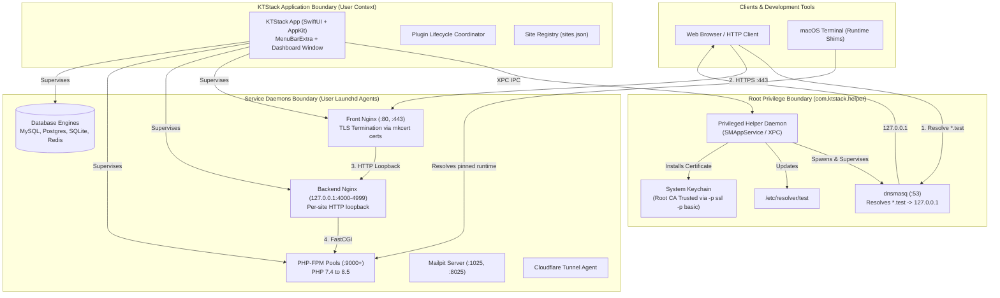
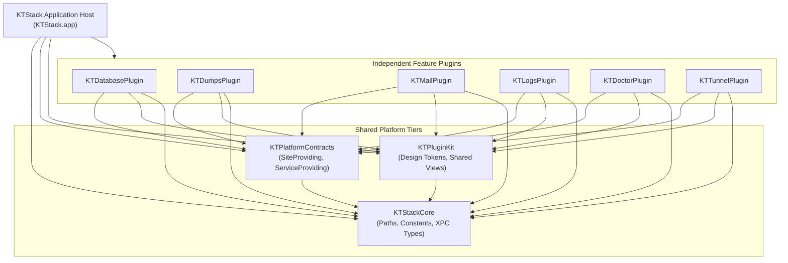

# 01. System Overview

[Index](README.md) · [Next: Source Code Architecture](02-source-code-architecture.md)

---

## 1. Current Purpose & System Vision

KTStack is a native macOS developer environment engineered specifically for modern web developers (PHP and Node.js). Operating as a native menu-bar application, it provides an all-in-one local hosting stack without requiring Docker, virtualization, or Homebrew installations on the developer's workstation.

### Proven Capabilities in the Working Tree:
- **Automatic `.test` Domain Routing & Trusted HTTPS**: Minting per-site certificates from an internal Local CA, automated `/etc/resolver/test` management, and loopback DNS resolution.
- **Dual-Tier Nginx Reverse Proxy Architecture**:
  - Front Nginx binds standard privileged ports (`:80`, `:443`), terminates TLS, and routes traffic by `Host`.
  - Independent loopback Backend Nginx instances (ports 4000–4999) serve individual PHP sites and forward FastCGI requests to dedicated PHP-FPM pools.
- **Multi-Version Isolated Runtime Management**: Simultaneous availability of PHP 7.4 through 8.5 (shipped as self-contained, relocated Homebrew bottles) and Node.js 20/22/24/26.
- **Built-in MIT Clean-Room Database Editor**: Multi-database GUI (MySQL, PostgreSQL, SQLite) featuring a high-performance AppKit virtualized table grid, floating cell editor, foreign key navigation, and interactive ER diagrams.
- **Developer Experience Micro-Services**:
  - `dd()` / `dump()` real-time object stream viewer (`KTDumpsPlugin`).
  - Integrated Mailpit SMTP server and HTML email inspector (`KTMailPlugin`).
  - Centralized log streaming engine (`KTLogsPlugin`).
  - Cloudflare Tunnel one-click public URL generation (`KTTunnelPlugin`).
  - System and network conflict diagnostic engine (`KTDoctorPlugin`).
- **Native macOS Interface**: Built with SwiftUI and AppKit, adhering to **`SwiftUI + Liquid Glass + Apple HIG`** for macOS 27+ with robust fallback support down to macOS 13.0 (Ventura).

---

## 2. Proven Actors

| Actor | Source Evidence | Privileges & Responsibilities |
|---|---|---|
| **macOS Developer (User)** | `KTStackApp.swift`, `MenuBarExtra`, Dashboard Views | Primary human operator. Adds sites, configures runtime versions, executes database queries, inspects logs, triggers tunnels. |
| **Local Web Browser / Client** | Outbound requests to `https://<site>.test` | Sends HTTP(S) requests resolved via port 53 loopback DNS to Front Nginx. |
| **Privileged Root Helper** | `com.ktstack.helper`, `HelperProtocol.swift` | Root daemon managed via `SMAppService`. Binds port 53 for `dnsmasq`, writes `/etc/resolver/<tld>`, and installs the Root CA into the System Keychain. |
| **Unprivileged Launchd Agents** | `ServiceManager.swift`, `SiteBackendSupervisor.swift` | User-context background jobs supervising Front Nginx, Backend Nginx instances, PHP-FPM pools, database engines, and Mailpit. |
| **Terminal Shell Environment** | `AppSupportPaths.shimsDir`, Shell shims | User shell executing `php`, `composer`, or `node`. Shims detect site-pinned versions from `sites.json`. |
| **Cloudflare Edge Gateway** | `KTTunnelPlugin`, `cloudflared` binary | Ingress proxy tunneling traffic from public URLs to local ports. |

---

## 3. System Boundary

---

## 4. Primary Components

| Component | Responsibility | Source Path |
|---|---|---|
| **KTStack App** | Application lifecycle, menu-bar representation (`MenuBarExtra`), multi-window orchestration, plugin composition root. | `KTStack/` |
| **KTStackKit** | Platform foundation: `ServiceManager`, `SiteRegistry`, `RuntimeManager`, and launchd job supervisors. | `KTStackKit/` |
| **KTStackHelper** | Standalone privileged helper daemon providing an XPC server for root operations. | `KTStackHelper/` |
| **KTStackCore** | Base Swift package containing XPC protocol contracts, constants, path definitions (`AppSupportPaths`). Zero UI dependencies. | `Packages/Core/KTStackCore/` |
| **KTPlatformContracts** | Pure Swift capability protocols decoupling plugins from platform implementation details. | `Packages/Contracts/KTPlatformContracts/` |
| **KTPluginKit** | Plugin SDK and design system: Tokens (`KTColor`, `KTRadius`), reusable components (`KTButton`, `KTModalCard`), lifecycle protocols. | `Packages/Plugin/KTPluginKit/` |
| **KTDatabasePlugin** | Clean-room MIT database editor: pure-Swift NIO drivers (MySQL, Postgres, Mongo), GRDB (SQLite), and virtualized table grid. | `Packages/Features/KTDatabasePlugin/` |
| **KTDumpsPlugin** | TCP/UDP socket server capturing serialized `dd()` and `dump()` payloads from Symfony VarDumper. | `Packages/Features/KTDumpsPlugin/` |
| **KTMailPlugin** | Embedded Mailpit interface displaying caught emails, headers, HTML/raw views. | `Packages/Features/KTMailPlugin/` |
| **KTLogsPlugin** | Real-time multi-source log stream viewer for Nginx, PHP-FPM, MySQL, and system daemons. | `Packages/Features/KTLogsPlugin/` |
| **KTDoctorPlugin** | Diagnostic subsystem probing network ports, helper status, config validity, and filesystem permissions. | `Packages/Features/KTDoctorPlugin/` |
| **KTTunnelPlugin** | Cloudflare Tunnel controller creating temporary secure public ingress to local sites. | `Packages/Features/KTTunnelPlugin/` |

---

## 5. Functional Domain Map

---

## 6. Subsystem Interaction Matrix

| Initiator | Target | Protocol / Mechanism | Operational Objective |
|---|---|---|---|
| KTStack App | KTStackHelper | Mach-O XPC (`NSXPCConnection`) | Root CA installation, `/etc/resolver/test` updates, port 53 binding. |
| KTStack App | Front Nginx | POSIX Signals (`SIGHUP`) | Atomic configuration reload upon site addition or TLS renewal. |
| KTStack App | PHP-FPM Pools | Signals (`SIGUSR2`) / launchd reload | Graceful pool reload following `php.ini` or extension modification. |
| KTDatabasePlugin | MySQL / Postgres | Async Swift Sockets (SwiftNIO) | Connection pooling, SQL query execution, metadata schema inspection. |
| KTDatabasePlugin | SQLite | Native C API (`GRDB.swift`) | High-concurrency local database inspection and transactional updates. |
| KTDumpsPlugin | PHP Runtimes | TCP Socket Listener (Port 9912) | Real-time payload ingestion from `VarDumper` stream clients. |
| Web Browser | Front Nginx | HTTP/1.1 & HTTP/2 over TLS (:443) | Application testing and development web traffic. |

---

[Index](README.md) · [Next: Source Code Architecture](02-source-code-architecture.md)
