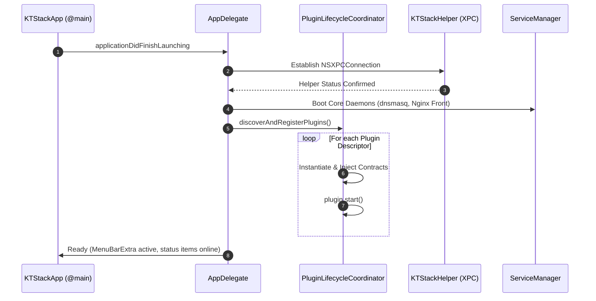

# 02. Source Code Architecture

[Previous: System Overview](01-system-overview.md) · [Index](README.md) · [Next: Data Models](03-data-models.md)

---

## 1. Concrete Architecture Style

KTStack is structured as a **modular macOS application** utilizing Swift Package Manager (SPM) local packages, orchestrated via XcodeGen (`project.yml`).

```text
┌────────────────────────────────────────────────────────────────────────┐
│                              Application                               │
│                KTStack/ (App Entry, MenuBar, Windowing)                │
├────────────────────────────────────────────────────────────────────────┤
│                           Feature Plugins                              │
│  KTDumpsPlugin  KTMailPlugin  KTLogsPlugin  KTTunnel  KTDoctor  KTDB   │
├────────────────────────────────────────────────────────────────────────┤
│                           Shared UI & SDK                              │
│           KTPluginKit (Tokens, Components, Plugin Protocols)           │
├────────────────────────────────────────────────────────────────────────┤
│                         Capability Contracts                           │
│           KTPlatformContracts (SiteProviding, ServiceProviding)        │
├────────────────────────────────────────────────────────────────────────┤
│                            Core Platform                               │
│           KTStackCore (XPC Protocols, Path Resolvers, Types)           │
└────────────────────────────────────────────────────────────────────────┘
```

The system combines:
- **Declarative UI**: SwiftUI for application shell, dashboard views, modals, and settings.
- **High-Performance AppKit**: Custom `NSTableView` and `NSTextView` components where low-level event interception, memory virtualization, or complex keyboard navigation are critical (e.g., the database table editor).
- **Protocol-Oriented Capability Injection**: Feature packages communicate with the platform solely through `KTPlatformContracts` protocols.
- **Single Source of Truth Build Definition**: `project.yml` generates `KTStack.xcodeproj`. Manual edits to `.xcodeproj` files are prohibited.

---

## 2. Repository Layout

```text
KTStack/
├── KTStack/                      # Main macOS Application Target
│   ├── App/                      # KTStackApp, AppDelegate, Lifecycle
│   ├── Resources/                # Assets, Entitlements, bundled bins
│   └── Views/                    # MenuBarExtra, Dashboard, Settings
├── KTStackKit/                   # Platform Services Implementation
│   ├── Registry/                 # SiteRegistry, SiteStorage
│   ├── Services/                 # ServiceManager, Nginx/PHP Controllers
│   └── Runtimes/                 # RuntimeManager, Bottle Resolvers
├── KTStackHelper/                # Privileged Helper Daemon (Root)
│   ├── main.swift                # Helper launch & Mach service listener
│   └── HelperCAManager.swift     # CA installation & DNS handling
├── Packages/
│   ├── Core/KTStackCore/         # Shared constants, XPC protocols, paths
│   ├── Contracts/KTPlatformContracts/ # Capability protocols for plugins
│   ├── Plugin/KTPluginKit/       # Design tokens, shared KT* views, SDK
│   └── Features/
│       ├── KTDumpsPlugin/        # Laravel/Symfony dump server
│       ├── KTMailPlugin/         # Mailpit client & email preview
│       ├── KTLogsPlugin/         # Unified real-time log viewer
│       ├── KTTunnelPlugin/       # Cloudflare Tunnel integration
│       ├── KTDoctorPlugin/       # Port & system health diagnostic
│       └── KTDatabasePlugin/     # MIT clean-room database manager
├── scripts/                      # Architecture check, CI, build scripts
├── docs/                         # Technical specification suite
├── project.yml                   # XcodeGen authoritative project spec
├── DOCTRINE.md                   # Immutable engineering tenets
└── CONTINUITY.md                 # Cross-session continuity ledger
```

---

## 3. Tiered Package Dependency Invariants

KTStack enforces strict unidirectional dependency boundaries. Compiler rules and `scripts/architecture-check.sh` enforce these constraints:

### Permitted Dependencies
```text
KTStack.app          → Every Feature Plugin, KTPluginKit, KTPlatformContracts, KTStackKit, KTStackCore, Sparkle
Feature Plugins      → KTPluginKit, KTPlatformContracts, KTStackCore, internal SPM deps
KTStackKit           → KTPlatformContracts (implements), KTStackCore
KTPluginKit          → KTStackCore, SwiftUI, AppKit
KTPlatformContracts  → KTStackCore
KTStackCore          → Foundation, Security (Zero UI, Zero AppKit)
KTStackHelper        → KTStackCoreStatic (Zero Platform, Zero UI)
```

### Prohibited Dependencies (Fails Build)
- **Feature Plugin ✗→ Feature Plugin**: Plugins must not import sibling plugins. Cross-feature data flow is mediated by platform contracts.
- **Feature Plugin ✗→ KTStackKit**: Plugins must never bind to concrete platform service implementations.
- **KTStackCore ✗→ UI Frameworks**: `KTStackCore` must remain pure Foundation/Security to protect the root helper's attack surface.

---

## 4. Application Lifecycle & Bootstrap Entry Points



1. **Initialization (`KTStackApp.swift`)**: Boots SwiftUI `MenuBarExtra` scene and registers `AppDelegate`.
2. **Helper Synchronization (`AppDelegate.swift`)**: Connects to `com.ktstack.helper` via Mach-O XPC; verifies local DNS and CA trust.
3. **Daemon Supervision (`ServiceManager.swift`)**: Verifies or launches user-level launchd jobs for Front Nginx and essential background services.
4. **Plugin Coordination (`PluginLifecycleCoordinator.swift`)**: Discovers plugins, injects platform contracts (`SiteProviding`, `ServiceProviding`), and triggers asynchronous background listeners.

---

## 5. UI Architecture: `SwiftUI + Liquid Glass + Apple HIG`

KTStack's user interface targets the modern **Liquid Glass** design language of macOS 27+ and iOS 27+, while maintaining fully functional fallbacks for macOS 13.0+.

### 5.1 Concept Distinction
- **Liquid Glass**: The optical material and dynamic visual language developed by Apple. It features real-time backdrop blur, ambient color reflection, responsive touch/cursor interaction, and state-driven morphing transitions.
- **SwiftUI**: The native declarative framework implementing this visual language in code.
- **Terminology**: Never refer to native macOS UI as generic "glassmorphism" (which denotes static CSS filters on the web). The authoritative keyword is **`SwiftUI + Liquid Glass + Apple HIG`**.

### 5.2 Native Liquid Glass APIs
```swift
// 1. Single interactive element
Text("Development Site")
    .font(.system(size: 13, weight: .medium))
    .padding(.horizontal, 12)
    .padding(.vertical, 6)
    .glassEffect(.regular.interactive(), in: .capsule)

// 2. Grouped elements in a single compositing pass
GlassEffectContainer(spacing: 16) {
    HStack(spacing: 12) {
        Button("Start") { }
            .buttonStyle(.glass)
        Button("Restart") { }
            .buttonStyle(.glassProminent)
    }
}
```

### 5.3 Modifier Ordering Rules
Layout, framing, and padding modifiers **must precede** `.glassEffect(...)`. Applying `.glassEffect()` before layout modifiers results in misaligned glass bounding boxes and blurred edges clipping incorrectly.

### 5.4 Availability Fallback Architecture
Because KTStack supports **macOS 13.0+**, all Liquid Glass APIs must be conditionally gated:
```swift
if #available(macOS 27, *) {
    content
        .padding(12)
        .glassEffect(.regular, in: .rect(cornerRadius: KTRadius.card))
} else {
    content
        .padding(12)
        .background(.ultraThinMaterial, in: RoundedRectangle(cornerRadius: KTRadius.card))
}
```

### 5.5 Performance Guardrails
- **No Per-Cell Glass in Dense Tables**: Never attach `.glassEffect()` to individual cells or rows inside virtualized tables (`KTGridKeyHandlingTableView`), log viewers, or process lists.
- **Outer Shell Only**: Apply glass materials to window chrome, floating HUDs, toolbars, modal dialogs, and navigation sidebars.
- **Container Batching**: Group multiple adjacent glass controls inside `GlassEffectContainer(spacing:)` to ensure the compositor executes a single offscreen render pass.

---

## 6. Error Handling & Architectural Exception Boundaries

1. **Process Supervision Boundaries**: Daemons (Nginx, PHP-FPM, MySQL) execute in independent process spaces. A crash in a PHP-FPM worker or database engine does not destabilize the menu-bar app.
2. **Fail-Closed Configuration Writes (`SiteDirectivesSaver`)**: When saving custom Nginx directives:
   - Candidate configuration is written to a temporary staging path.
   - `nginx -t` tests syntax and upstream validity.
   - If validation passes, configuration is committed and Nginx reloaded; otherwise, staging is discarded, preserving the running proxy.
3. **Database Driver Isolation**: Database network socket errors are encapsulated within driver errors (`KTDatabaseError`) and surfaced to the UI without crashing the active workspace.
4. **Helper RPC Resilience**: Helper XPC dispatches utilize timeout boundaries. If the privileged helper is unregistered, the app surfaces an explicit user authorization prompt rather than hanging.

---

[Previous: System Overview](01-system-overview.md) · [Index](README.md) · [Next: Data Models](03-data-models.md)
