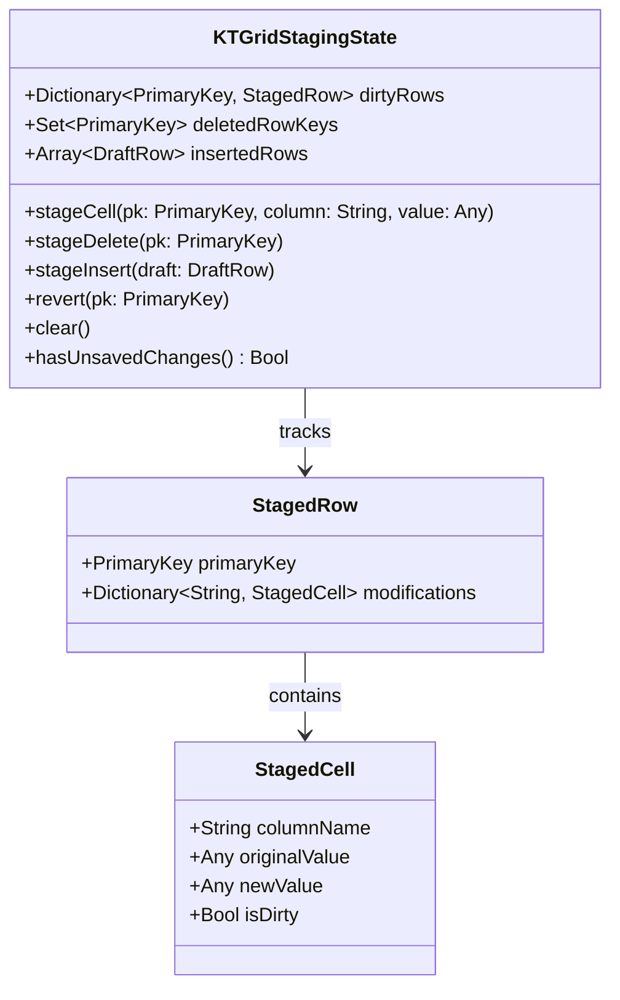

# 03. Data Models & Storage Architecture

[Previous: Source Code Architecture](02-source-code-architecture.md) · [Index](README.md) · [Next: Authentication & Security](04-auth-and-security.md)

---

## 1. Storage Overview

KTStack is designed as a local-first desktop application. Unlike web backends with centralized relational databases, KTStack manages its operational state using a hybrid model:
1. **JSON Document Stores**: Stored in `~/Library/Application Support/KTStack/` for site metadata, user preferences, and runtime tracking.
2. **In-Memory Reactive Models**: Swift `@Observable` / `ObservableObject` structures powering reactive SwiftUI bindings.
3. **PK-Indexed Virtual Grid Staging**: In-memory transactional staging state inside `KTDatabasePlugin` for database record browsing and editing.
4. **Target User Databases**: Direct client connections to local database files (`.sqlite`) or network engines (MySQL, PostgreSQL, MongoDB).

---

## 2. Configuration Schemas & Document Storage

### 2.1 Site Registration Schema (`sites.json`)

Site configuration is stored in `~/Library/Application Support/KTStack/sites.json`. The schema is parsed into the `Site` model:

```json
{
  "version": 1,
  "sites": [
    {
      "id": "550e8400-e29b-41d4-a716-446655440000",
      "name": "my-laravel-app",
      "path": "/Users/developer/Sites/my-laravel-app",
      "docroot": "public",
      "domain": "my-laravel-app",
      "tld": "test",
      "phpVersion": "8.3",
      "secure": true,
      "backendPort": 4012,
      "aliases": ["app-api.test", "admin.my-laravel-app.test"],
      "envVars": {
        "APP_ENV": "local",
        "APP_DEBUG": "true"
      },
      "frontDirectives": "client_max_body_size 64M;",
      "proxyTarget": null
    }
  ]
}
```

### Field Definitions:
- `id` (UUID): Stable internal unique identifier.
- `name` (String): Display name of the site.
- `path` (String): Root directory on the local filesystem.
- `docroot` (String): Relative web root served by Nginx (e.g., `public`, `dist`, `web`).
- `domain` / `tld` (String): Hostname resolution targets (`<domain>.<tld>`).
- `phpVersion` (String): Pinned PHP version (`7.4` to `8.5`).
- `secure` (Bool): If `true`, Front Nginx mints and serves local TLS certificates.
- `backendPort` (Int): Dedicated loopback port (4000–4999) for the site's backend Nginx worker.
- `aliases` ([String]): Alternate domain names injected into Nginx `server_name` and TLS Subject Alternative Names (SAN).
- `envVars` ([String: String]): Environment variables injected into FastCGI requests (`fastcgi_param`).
- `proxyTarget` (Optional URL): For reverse-proxy sites forwarding traffic to local or remote ports.

---

## 3. Database Editor Staging Model (`KTDatabasePlugin`)

The database editor does not mutate database records directly on keystroke. It utilizes a **PK-indexed staging model** (`KTGridStagingState`) that prevents corruption during virtualized scrolling:



### Invariants of the Staging Architecture:
1. **Primary Key Indexing**: Modifications are mapped to the row's immutable **Primary Key (PK)**, never to visual row indices. When virtualized scrolling reuses table view cells, or when sorting changes visual order, staged edits remain attached to their target records.
2. **Compound Key Support**: Tables with composite primary keys use a deterministic hashed key structure (`CompositePrimaryKey([colA: valA, colB: valB])`).
3. **Draft Row Identity**: Unsaved inserted rows receive temporary synthetic UUID keys prefixed with `draft-` until committed to the database.

---

## 4. Database Schema Metadata Models

To render tables, columns, and foreign-key navigation without proprietary drivers, `KTDatabasePlugin` defines unified metadata structures:

```swift
public struct KTTableSchema: Sendable, Identifiable {
    public let id: String
    public let name: String
    public let columns: [KTColumn]
    public let primaryKeyColumns: [String]
    public let foreignKeys: [KTForeignKey]
    public let indexes: [KTIndex]
}

public struct KTColumn: Sendable, Identifiable {
    public let id: String
    public let name: String
    public let typeName: String
    public let isNullable: Bool
    public let defaultValue: String?
    public let isPrimaryKey: Bool
    public let isAutoIncrement: Bool
}

public struct KTForeignKey: Sendable {
    public let name: String
    public let sourceColumn: String
    public let targetTable: String
    public let targetColumn: String
}
```

---

## 5. Persistence Lifecycles & Concurrency Rules

1. **Atomic File Replacement**: File-based persistence (`sites.json`, `settings.json`) writes candidate JSON to a `.tmp` file and replaces the destination using `FileManager.replaceItem(at:withItemAt:)`. This guarantees atomic commits and prevents corruption during system power loss.
2. **Transactional Parity**:
   - **PostgreSQL**: Implements batch commits via parameterized queries (`$1, $2, ...`) wrapped in `BEGIN` and `COMMIT`.
   - **SQLite**: Enforces `BEGIN IMMEDIATE TRANSACTION` to prevent lock escalations when editing WAL-mode databases.
   - **MySQL**: Wraps batch updates in explicit transactions with autocommit disabled.

---

[Previous: Source Code Architecture](02-source-code-architecture.md) · [Index](README.md) · [Next: Authentication & Security](04-auth-and-security.md)
