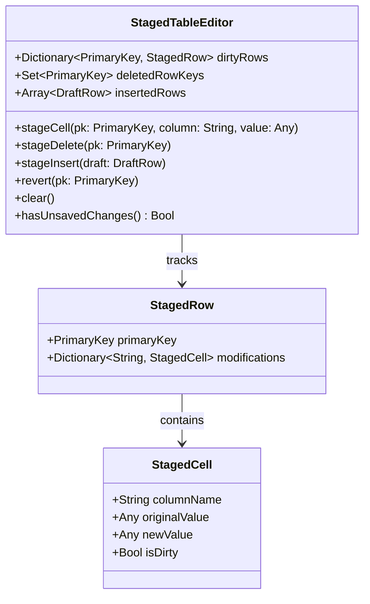

# 03. Data Models & Storage Architecture

[Previous: Source Code Architecture](02-source-code-architecture.md) · [Index](README.md) · [Next: Authentication & Security](04-auth-and-security.md)

---

## 1. Storage Overview

KTStack is designed as a local-first desktop application. Unlike web backends with centralized relational databases, KTStack manages its operational state using a hybrid model:
1. **JSON Document Stores**: Stored in `~/Library/Application Support/KTStack/` for site metadata, user preferences, and runtime tracking.
2. **In-Memory Reactive Models**: Swift `@Observable` / `ObservableObject` structures powering reactive SwiftUI bindings.
3. **PK-Indexed Virtual Grid Staging**: In-memory transactional staging state inside `KTDatabasePlugin` for database record browsing and editing.
4. **Target User Databases**: Direct client connections to local database files (`.sqlite`) or network engines (MySQL, PostgreSQL, MongoDB).

---

## 2. Configuration Schemas & Document Storage

### 2.1 Site Registration Schema (`sites.json`)

Site configuration is stored in `~/Library/Application Support/KTStack/config/sites/sites.json` (`AppSupportPaths.sitesRegistryFile`). The file is a top-level JSON array of `Site` records; there is no wrapper object or version field:

```json
[
  {
    "id": "550E8400-E29B-41D4-A716-446655440000",
    "name": "my-laravel-app",
    "path": "/Users/developer/Sites/my-laravel-app",
    "docroot": "/Users/developer/Sites/my-laravel-app/public",
    "domain": "my-laravel-app.test",
    "phpVersion": "8.3",
    "type": "php",
    "serverEngine": "nginx",
    "secure": true,
    "backendPort": 4012,
    "nodeEnabled": false,
    "aliases": ["admin.my-laravel-app.test"],
    "envVars": { "APP_ENV": "local" },
    "frontDirectives": "client_max_body_size 64M;"
  }
]
```

### Field Definitions:
- `id` (UUID): Stable internal unique identifier (generated when missing).
- `name` (String): Display name of the site.
- `path` (String): Absolute project folder; empty for proxy sites, which have no folder.
- `docroot` (String): Absolute web root served by the front (for example `<path>/public`); empty for proxy sites.
- `domain` (String): Full hostname including the TLD (for example `my-laravel-app.test`). The TLD itself is a global preference, not a per-site field.
- `phpVersion` (String): Pinned PHP version.
- `type` (String): `php`, `staticSite`, `node` or `proxy`.
- `serverEngine` (String): `nginx` (default) or `apache` backend for PHP sites.
- `secure` (Bool, default `false`): Serve over HTTPS with a locally minted certificate.
- `backendPort` (Int, optional): Loopback port (4000–4999) of the PHP site's backend; backfilled for older files.
- `nodePort` / `nodeCommand` / `nodeEnabled`: Node site process settings.
- `databaseName` (String, optional): Database provisioned with the site.
- `proxyTarget` (String, optional): Upstream URL for proxy sites.
- `aliases` ([String]): Extra hostnames in `server_name` and the certificate SAN.
- `envVars` ([String: String]): Environment passed to the PHP backend (`fastcgi_param` / `SetEnv`).
- `frontDirectives` (String, optional): Verbatim nginx directives included in the site's front server block.

Entries are decoded one by one: an unreadable entry is set aside in `sites.rejected-<timestamp>.json`, and a file that is not a JSON array at all blocks writes until it is fixed (see `SiteRegistry+Store.swift`).

---

## 3. Database Editor Staging Model (`KTDatabasePlugin`)

The database editor does not mutate database records directly on keystroke. It utilizes a **PK-indexed staging model** (`StagedTableEditor`) that prevents corruption during virtualized scrolling:



### Invariants of the Staging Architecture:
1. **Primary Key Indexing**: Modifications are mapped to the row's immutable **Primary Key (PK)**, never to visual row indices. When virtualized scrolling reuses table view cells, or when sorting changes visual order, staged edits remain attached to their target records.
2. **Compound Key Support**: Tables with composite primary keys use a deterministic hashed key structure (`CompositePrimaryKey([colA: valA, colB: valB])`).
3. **Draft Row Identity**: Unsaved inserted rows receive temporary synthetic UUID keys prefixed with `draft-` until committed to the database.

---

## 4. Database Schema Metadata Models

To render tables, columns, and foreign-key navigation without proprietary drivers, `KTDatabasePlugin` defines unified metadata structures:

```swift
public struct KTTableSchema: Sendable, Identifiable {
    public let id: String
    public let name: String
    public let columns: [KTColumn]
    public let primaryKeyColumns: [String]
    public let foreignKeys: [KTForeignKey]
    public let indexes: [KTIndex]
}

public struct KTColumn: Sendable, Identifiable {
    public let id: String
    public let name: String
    public let typeName: String
    public let isNullable: Bool
    public let defaultValue: String?
    public let isPrimaryKey: Bool
    public let isAutoIncrement: Bool
}

public struct KTForeignKey: Sendable {
    public let name: String
    public let sourceColumn: String
    public let targetTable: String
    public let targetColumn: String
}
```

---

## 5. Persistence Lifecycles & Concurrency Rules

1. **Atomic File Replacement**: JSON stores (`sites.json`, `services.json`, query history) are written with `Data.write(to:options: .atomic)`, which writes a temporary file and renames it over the destination. Backup manifests and SQLite restores use `FileManager.replaceItemAt(_:withItemAt:)`. App preferences live in `UserDefaults`, not a settings file.
2. **Transactional Parity**:
   - **PostgreSQL**: Implements batch commits via parameterized queries (`$1, $2, ...`) wrapped in `BEGIN` and `COMMIT`.
   - **SQLite**: Enforces `BEGIN IMMEDIATE TRANSACTION` to prevent lock escalations when editing WAL-mode databases.
   - **MySQL**: Wraps batch updates in explicit transactions with autocommit disabled.

---

[Previous: Source Code Architecture](02-source-code-architecture.md) · [Index](README.md) · [Next: Authentication & Security](04-auth-and-security.md)
