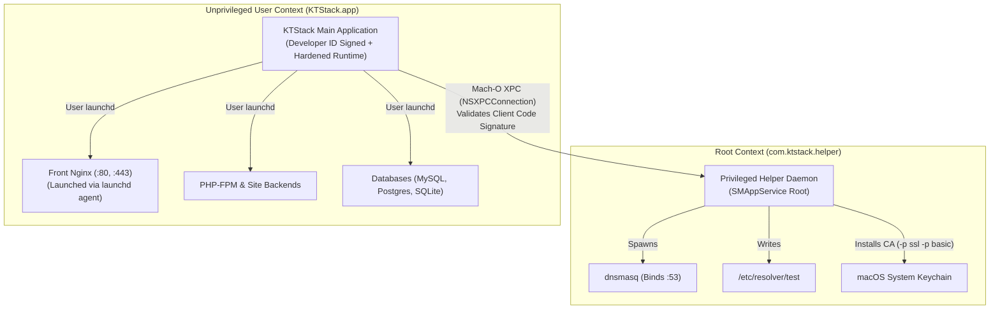

# 04. Authentication, Authorization & Security

[Previous: Data Models](03-data-models.md) · [Index](README.md) · [Next: Business Domains](05-business-domains.md)

---

## 1. Security Architecture & Privilege Model

Local development environments face a classic privilege challenge: binding system ports (`:80`, `:443`, `:53`) and managing system DNS `/etc/resolver/` typically require root permissions, but running an entire web server, database engine, and UI as root introduces unacceptable security risks.

KTStack resolves this by implementing a **strict least-privilege architecture**:



### The Root Helper Contract:
The root helper (`KTStackHelper`) is restricted to strictly three actions:
1. Managing `/etc/resolver/<tld>` to point local domain queries to `127.0.0.1`.
2. Spawning and supervising `dnsmasq` bound to privileged port `53`.
3. Installing and trusting the generated Root CA in the System Keychain.

All other operations—reverse proxies, PHP-FPM pools, database engines, site file access, and user interaction—execute entirely within the unprivileged user's security context.

---

## 2. Privilege Separation via `SMAppService` & XPC

KTStack utilizes modern macOS 13+ `SMAppService.daemon(plistName: "com.ktstack.helper.plist")`, completely replacing deprecated `SMJobBless` workflows.

### 2.1 XPC Protocol Contract (`HelperProtocol.swift`)
```swift
@objc(KTStackHelperProtocol)
public protocol KTStackHelperProtocol {
    func installResolver(tld: String, withReply reply: @escaping (Bool, String?) -> Void)
    func removeResolver(tld: String, withReply reply: @escaping (Bool, String?) -> Void)
    func startDnsmasq(binaryPath: String, configPath: String, withReply reply: @escaping (Bool, String?) -> Void)
    func stopDnsmasq(withReply reply: @escaping (Bool, String?) -> Void)
    func installRootCA(certPath: String, withReply reply: @escaping (Bool, String?) -> Void)
    func removeRootCA(certPath: String, withReply reply: @escaping (Bool, String?) -> Void)
    func getVersion(withReply reply: @escaping (String) -> Void)
}
```

### 2.2 Client Validation & Code Signature Verification
To prevent malicious local processes from exploiting the XPC listener, `KTStackHelper` validates the caller's identity on every connection:
1. Retrieves client process audit token via `xpc_connection_get_audit_token`.
2. Evaluates code signature using `SecCodeCopyGuestWithAttributes`.
3. Verifies that the client's **Team ID** matches the official KTStack Apple Developer Team ID (`SecRequirementCreateWithString`).
4. Non-matching or untrusted callers are immediately rejected and logged.

---

## 3. macOS Root CA Trust & Verification Pipeline

KTStack mints internal TLS certificates via an embedded `mkcert` engine. To ensure modern browsers (Safari, Chrome) trust local sites without security warnings, the Root CA must be properly configured.

### 3.1 Policy Configuration Flags
When the helper installs the certificate into `/Library/Keychains/System.keychain`, it invokes:
```bash
security add-trusted-cert -d -r trustRoot -p ssl -p basic -k /Library/Keychains/System.keychain /path/to/rootCA.pem
```
**Critical Security Invariant**: The `-p ssl -p basic` flags are mandatory. Omitting them creates an ambiguous wildcard trust record that fails modern macOS strict TLS evaluation. Specifying `ssl` and `basic` binds trust explicitly to `sslServer` and `basicX509` policy OIDs.

### 3.2 Native Verification vs. CLI False Positives
Calling `security find-certificate` merely verifies the file exists in a keychain; it does **not** prove trust. KTStack evaluates trust using native `Security.framework` APIs:

```swift
public func verifyCertificateTrust(cert: SecCertificate) -> Bool {
    var trust: SecTrust?
    let policy = SecPolicyCreateSSL(true, nil)
    guard SecTrustCreateWithCertificates(cert, policy, &trust) == errSecSuccess,
          let trust else { return false }
    
    var error: CFError?
    return SecTrustEvaluateWithError(trust, &error)
}
```

---

## 4. Hardened Runtime & Code Signing Model

KTStack is distributed outside the Mac App Store as an open-source Developer-ID signed application.

### 4.1 Entitlements (`KTStack.entitlements`)
- `com.apple.security.cs.allow-jit`: Required for V8 (Node.js) runtime execution.
- `com.apple.security.cs.allow-unsigned-executable-memory`: Required by PHP-FPM JIT compilation.
- `com.apple.security.cs.disable-library-validation`: Permits the app to load relocatable PHP dynamic extensions (`redis.so`, `xdebug.so`) compiled separately.
- `com.apple.security.network.server` & `com.apple.security.network.client`: Local network sockets.

### 4.2 Sandboxing Rationale
KTStack is deliberately **not sandboxed** (`com.apple.security.app-sandbox` is omitted). Sandboxing prohibits developer tools from accessing arbitrary project directories in `~/Sites` or `~/Projects`, interacting with `/etc/resolver/`, and supervising user launchd background jobs. Gatekeeper security is ensured via Apple Notarization and Hardened Runtime enforcement.

---

[Previous: Data Models](03-data-models.md) · [Index](README.md) · [Next: Business Domains](05-business-domains.md)
