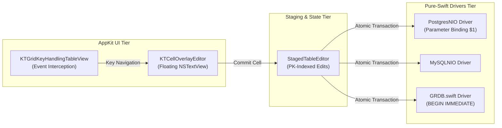

# 05. Business Domains & Functional Capabilities

[Previous: Authentication & Security](04-auth-and-security.md) · [Index](README.md) · [Next: Integration & Background](06-integration-and-background.md)

---

## 1. Domain Overview

KTStack is decomposed into distinct, self-contained functional domains:

```text
┌────────────────────────────────────────────────────────────────────────┐
│                        Core Platform Domains                           │
│        Site Management        •        Service Daemon Supervision      │
├────────────────────────────────────────────────────────────────────────┤
│                       Feature Plugin Domains                           │
│   Database Editor   •   Dumps Stream   •   Mailpit   •   Logs Viewer   │
│             System Doctor (Probing)    •   Cloudflare Tunnel           │
└────────────────────────────────────────────────────────────────────────┘
```

---

## 2. Site Management Domain (`KTStackKit`)

The Sites domain registers local web projects, binds them to local `.test` domains, and wires reverse proxy routes:

### 2.1 Capabilities
- **Site Registration**: Users link a local directory (`~/Sites/my-project`). The engine resolves the web root (detecting `public`, `dist`, or root).
- **Domain & Alias Allocation**: Automatically derives `<folder>.test`. Allows arbitrary custom domains and multiple aliases (`api.project.test`).
- **Runtime Version Pinning**: Binds the site to a specific PHP version (`7.4`–`8.5`).
- **Nginx Route Generation**:
  - Writes a Front Nginx server block (`site-front/<uuid>.conf`).
  - Writes a Loopback Backend Nginx server block (`site-backends/<uuid>.conf`) binding a dedicated port (4000–4999).
  - Validates syntax via `nginx -t` before issuing atomic SIGHUP reloads.

---

## 3. Service Supervision Domain (`KTStackKit`)

Supervises unprivileged launchd daemons and background processes:

| Service | Default Port | Supervision Strategy | Config Location |
|---|---|---|---|
| **Front Nginx** | 80, 443 | User launchd agent (`com.ktstack.nginx`) | `~/Library/Application Support/KTStack/nginx/nginx.conf` |
| **PHP-FPM Pools** | 9074–9085 | Per-version launchd agents (`com.ktstack.php.<ver>`) | `~/Library/Application Support/KTStack/config/php/<ver>/php-fpm.conf` |
| **MySQL / MariaDB**| 3306 | User launchd agent (`com.ktstack.mysql`) | `~/Library/Application Support/KTStack/mysql/my.cnf` |
| **PostgreSQL** | 5432 | User launchd agent (`com.ktstack.postgres`) | `~/Library/Application Support/KTStack/postgres/postgresql.conf` |
| **Redis** | 6379 | User launchd agent (`com.ktstack.redis`) | In-memory with optional RDB snapshot |
| **Mailpit** | 1025, 8025 | User launchd agent (`com.ktstack.mailpit`) | CLI flags (`--smtp-port 1025 --ui-port 8025`) |

---

## 4. Database Management Domain (`KTDatabasePlugin`)

A full-featured, clean-room MIT native database workspace supporting MySQL, MariaDB, PostgreSQL, and SQLite.



### Core Innovations:
1. **Focus-Free Cell Editing (`KTCellOverlayEditor`)**: Bypasses the AppKit `NSTextFieldDelegate` field editor trap. A floating `NSTextView` sits atop the edited cell, handling Tab, Enter, and Arrow movements seamlessly.
2. **Keyboard Interception (`KTGridKeyHandlingTableView`)**: Direct key event dispatch for shortcuts:
   - `⌘N`: Insert draft row.
   - `Delete`: Mark row for deletion.
   - `⌘S`: Commit staged changes in an atomic transaction.
   - `⌘Z`: Revert dirty cells.
3. **PK-Indexed Virtual Grid Staging**: Edit operations are mapped to primary keys, ensuring visual scrolling or re-sorting never misplaces pending changes.

---

## 5. Developer Experience Plugins

### 5.1 Dumps Stream Viewer (`KTDumpsPlugin`)
- Embeds a lightweight TCP socket server listening on `127.0.0.1:9912`.
- Ingests serialized payloads from Symfony VarDumper / Laravel `dd()` and `dump()`.
- Renders an interactive, collapsible tree hierarchy with syntax highlighting and copy-to-clipboard capabilities.

### 5.2 Mail Testing (`KTMailPlugin`)
- Intercepts local email sent via PHP `mail()` or SMTP (`localhost:1025`).
- Embeds Mailpit's web inspector directly within a native macOS tab, complete with MIME parts inspection, raw headers, and spam score analysis.

### 5.3 Unified Log Viewer (`KTLogsPlugin`)
- Tails log files in real-time (`access.log`, `error.log`, `php-fpm.log`, MySQL error logs) using non-blocking dispatch source file observers.
- Provides regex search, level filtering (DEBUG, INFO, WARN, ERROR), and colorized terminal-grade formatting.

### 5.4 System Health Doctor (`KTDoctorPlugin`)
- Probes system prerequisites: Helper connectivity, `/etc/resolver/test` routing, Root CA validity in Keychain, port conflicts on `:80`/`:443`/`:53`, and Nginx configuration health (`nginx -t`).

### 5.5 Cloudflare Tunnel Sharing (`KTTunnelPlugin`)
- Spawns a supervised `cloudflared` process binding to a specific site's local port.
- Emits a temporary public HTTPS URL (`https://<random>.trycloudflare.com`) for remote testing, webhooks, or client previews.

---

[Previous: Authentication & Security](04-auth-and-security.md) · [Index](README.md) · [Next: Integration & Background](06-integration-and-background.md)
