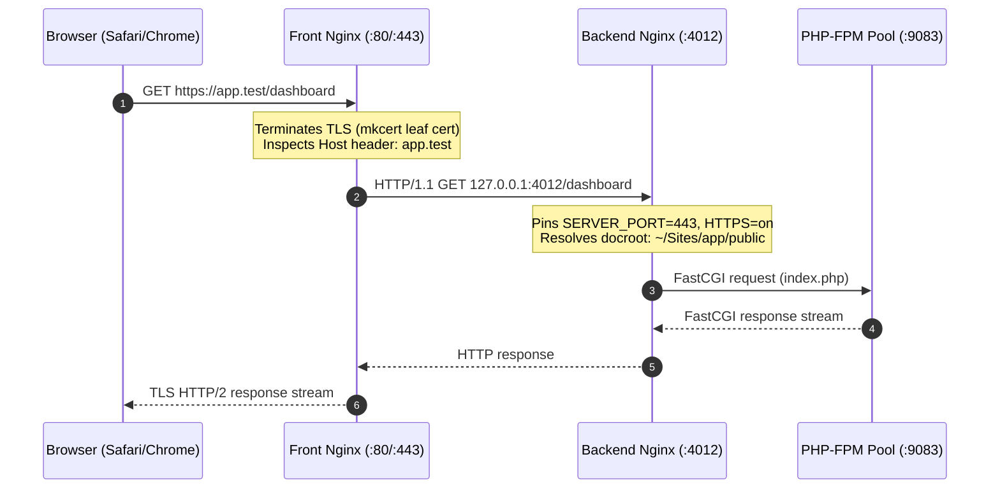

# 06. Integration & Background Processing

[Previous: Business Domains](05-business-domains.md) · [Index](README.md) · [Next: API & Data Flow](07-api-and-data-flow.md)

---

## 1. Background Architecture Overview

KTStack manages a coordinated cluster of background daemons and system integrations running natively on macOS without virtualization:

```text
┌────────────────────────────────────────────────────────────────────────┐
│                        macOS System Context                            │
│    /etc/resolver/test        •        System Keychain (Root CA)        │
├────────────────────────────────────────────────────────────────────────┤
│                       Root Privileged Daemon                           │
│        com.ktstack.helper     ───►     dnsmasq (Port 53 Loopback)      │
├────────────────────────────────────────────────────────────────────────┤
│                     User Launchd Agent Daemons                         │
│   Front Nginx (:80, :443)    •    Per-Site Backend Nginx (:4000-4999)  │
│   PHP-FPM 7.4 → 8.5 Pools    •    MySQL / Postgres / Redis / Mailpit   │
├────────────────────────────────────────────────────────────────────────┤
│                      Third-Party Integrations                          │
│   mkcert (TLS Minting)       •    cloudflared (Tunnel Ingress)         │
│   Sparkle (Appcast Updates)  •    Symfony VarDumper (Stream Protocol)  │
└────────────────────────────────────────────────────────────────────────┘
```

---

## 2. Dual-Tier Nginx Reverse Proxy Topology

Because macOS prohibits binding non-root processes to ports below 1024 without root privileges or special entitlements, and to enable per-site runtime isolation, KTStack uses a **Dual-Tier Nginx Topology**:



### 2.1 Front Nginx (Gateway)
- **Role**: Binds `:80` and `:443`.
- **Certificates**: Dynamically links certificates generated by `mkcert` (`certs/<site>.pem`, `certs/<site>-key.pem`).
- **Proxy Headers**: Injects `Host`, `X-Real-IP`, `X-Forwarded-For`, `X-Forwarded-Proto`, and WebSocket upgrade directives (`$http_upgrade`).

### 2.2 Loopback Backend Nginx (Worker)
- **Role**: Dedicated loopback HTTP server assigned a unique private port (4000–4999) per active PHP site.
- **Port Masking**: Overrides FastCGI environment variables (`fastcgi_param SERVER_PORT 443; fastcgi_param HTTPS on;`). This prevents web frameworks (Laravel, Symfony, WordPress) from generating incorrect redirects containing internal loopback ports.

---

## 3. Local DNS & macOS System Resolver (`dnsmasq`)

Local domain routing is achieved without modifying the global `/etc/hosts` file:
1. **Resolver Entry**: The privileged helper creates `/etc/resolver/test` with contents:
   ```text
   nameserver 127.0.0.1
   port 53
   ```
2. **mDNSResponder Integration**: macOS's native DNS subsystem inspects `/etc/resolver/` and routes all queries ending in `.test` directly to `127.0.0.1:53`.
3. **`dnsmasq` Daemon**: Spawns with arguments `--listen-address=127.0.0.1 --port=53 --address=/.test/127.0.0.1`. Queries for any subdomain (`sub.app.test`) immediately resolve to `127.0.0.1`.

---

## 4. Local TLS Management (`mkcert`)

KTStack vendors the `mkcert` engine inside `KTStack/Resources/bin/mkcert`:
1. **Root CA Generation**: Mints a local certificate authority stored in `~/Library/Application Support/KTStack/ca/`.
2. **Leaf Certificate Generation**: When a site is created or secure flag toggled, KTStack invokes:
   ```bash
   mkcert -cert-file certs/<id>.pem -key-file certs/<id>-key.pem <domain>.test *. <domain>.test [aliases...]
   ```
3. **Nginx Integration**: Front Nginx hot-reloads via `SIGHUP` without dropping active HTTP connections.

---

## 5. Launchd Supervision & Process Management

Background daemons are managed through macOS user launchd services via `ServiceManager` and `SiteBackendSupervisor`:

```swift
public final class SiteBackendSupervisor {
    public func startBackend(for site: Site) throws {
        let label = "com.ktstack.site.\(site.id)"
        let plistPath = AppSupportPaths.launchdPlist(for: label)
        try writeLaunchdPlist(for: site, to: plistPath)
        try Process.run("/bin/launchctl", ["bootstrap", "gui/\(getuid())", plistPath.path])
    }

    public func stopBackend(for site: Site) throws {
        let label = "com.ktstack.site.\(site.id)"
        try? Process.run("/bin/launchctl", ["bootout", "gui/\(getuid())/\(label)"])
    }
}
```

### Invariant:
Services are always identified and torn down by their registered **launchd label**, never by crude process killing (`pkill nginx`), ensuring KTStack never terminates unrelated processes on the user's workstation.

---

## 6. Sparkle Auto-Update Integration

KTStack incorporates the Sparkle 2 framework for seamless software updates:
- **Appcast Feed**: Queries the official release manifest over HTTPS.
- **Cryptographic Verification**: Updates are signed using an EdDSA (ed25519) private key; Sparkle validates the signature against the public key embedded in `Info.plist` (`SUPublicEDKey`).
- **Non-Intrusive**: Update checks run asynchronously in the background and prompt via standard macOS system notifications.

---

[Previous: Business Domains](05-business-domains.md) · [Index](README.md) · [Next: API & Data Flow](07-api-and-data-flow.md)
