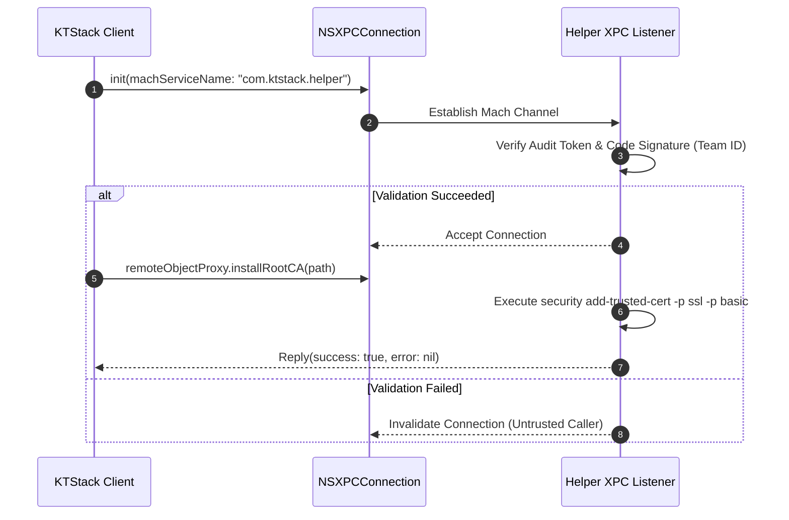
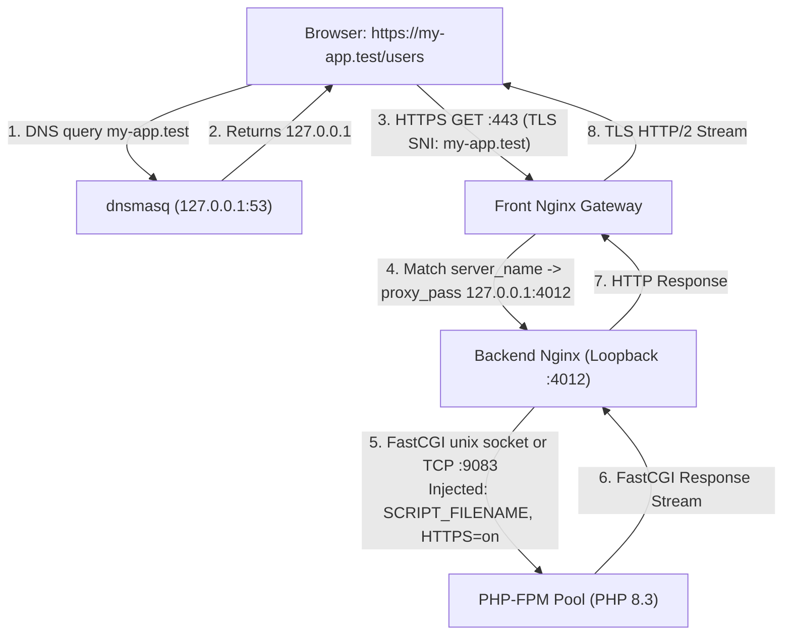

# 07. API & Data Flow Specifications

[Previous: Integration & Background](06-integration-and-background.md) · [Index](README.md) · [Next: Runtime & Deployment](08-runtime-and-deployment.md)

---

## 1. System Communication Tiers

KTStack coordinates communication across three distinct layers:
1. **Inter-Process Communication (IPC)**: Mach-O XPC between the unprivileged app and the privileged root helper.
2. **In-Process Capability Contracts**: Swift protocols in `KTPlatformContracts` decoupling feature plugins from platform implementations.
3. **Network Data Flow**: HTTP/TLS reverse proxy routing, FastCGI protocol forwarding, and socket stream ingestion.

```text
┌────────────────────────────────────────────────────────────────────────┐
│                        In-Process Swift Tier                           │
│   App Host  ──(PluginLifecycle)──►  Feature Plugins (DB, Logs, Mail)   │
│   App Host  ◄──(KTPlatformContracts)──  SiteProviding, ServiceProviding│
├────────────────────────────────────────────────────────────────────────┤
│                       Inter-Process (IPC) Tier                         │
│   KTStack.app  ──(Mach-O XPC / HelperProtocol)──►  com.ktstack.helper │
├────────────────────────────────────────────────────────────────────────┤
│                       Network & Wire Data Flow                         │
│   Browser  ──(HTTPS/TLS :443)──►  Front Nginx                          │
│   Front Nginx  ──(HTTP Loopback)──►  Backend Nginx                     │
│   Backend Nginx  ──(FastCGI)──►  PHP-FPM Pool                          │
│   Symfony/Laravel  ──(TCP :9912)──►  KTDumpsPlugin Socket              │
└────────────────────────────────────────────────────────────────────────┘
```

---

## 2. Privileged Helper XPC Contract (`HelperProtocol.swift`)

The privileged helper exposes an `@objc` protocol accessible over Mach-O XPC via `NSXPCConnection`:

```swift
@objc(KTStackHelperProtocol)
public protocol KTStackHelperProtocol {
    func installResolver(tld: String, withReply reply: @escaping (Bool, String?) -> Void)
    func removeResolver(tld: String, withReply reply: @escaping (Bool, String?) -> Void)
    func startDnsmasq(binaryPath: String, configPath: String, withReply reply: @escaping (Bool, String?) -> Void)
    func stopDnsmasq(withReply reply: @escaping (Bool, String?) -> Void)
    func installRootCA(certPath: String, withReply reply: @escaping (Bool, String?) -> Void)
    func removeRootCA(certPath: String, withReply reply: @escaping (Bool, String?) -> Void)
    func getVersion(withReply reply: @escaping (String) -> Void)
}
```

### XPC Connection Lifecycle:


---

## 3. Platform Capability Protocols (`KTPlatformContracts`)

To preserve modular isolation, feature packages never import `KTStackKit` or concrete services directly. They depend exclusively on capability protocols:

### 3.1 `SiteProviding` Contract
```swift
public protocol SiteProviding: Sendable {
    func getAllSites() async -> [Site]
    func getSite(by id: UUID) async -> Site?
    func observeSiteChanges() -> AsyncStream<[Site]>
}
```
*Used by*: `KTLogsPlugin` (populating site log pickers), `KTTunnelPlugin` (selecting sites to tunnel), `KTDoctorPlugin` (validating site configurations).

### 3.2 `ServiceProviding` Contract
```swift
public protocol ServiceProviding: Sendable {
    func getStatus(for service: ServiceKind) async -> ServiceStatus
    func restartService(_ service: ServiceKind) async throws
    func observeServiceStatuses() -> AsyncStream<[ServiceKind: ServiceStatus]>
}
```
*Used by*: `KTDoctorPlugin` (port probe verification), MenuBar status monitors.

---

## 4. End-to-End HTTP Request Data Flow

The following diagram tracks an incoming developer request from initial browser dispatch to backend execution:



### Data Flow Invariants:
1. **Loopback Port Isolation**: Each PHP site backend operates on an isolated port in the `4000-4999` range. Cross-site traffic leakage is structurally impossible.
2. **Environment Variable Injection**: Custom environment variables defined in `sites.json` are passed dynamically via FastCGI parameters (`fastcgi_param KEY "VALUE"`), ensuring PHP processes receive project-specific configuration without polluting system-wide environment variables.

---

[Previous: Integration & Background](06-integration-and-background.md) · [Index](README.md) · [Next: Runtime & Deployment](08-runtime-and-deployment.md)
