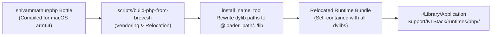
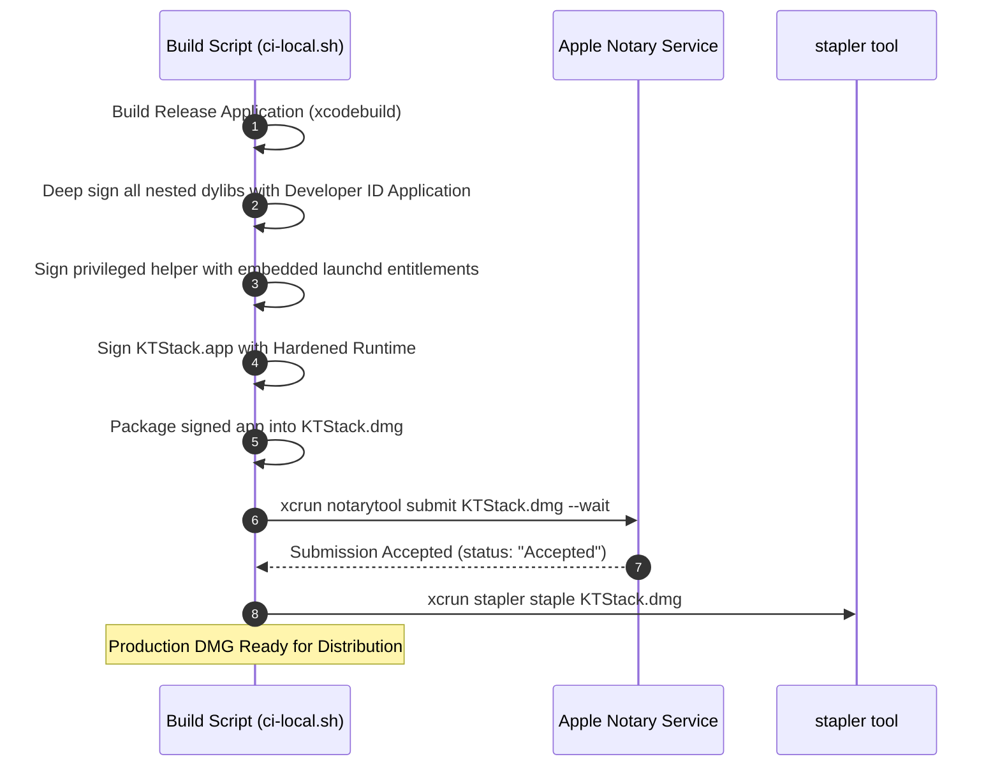

# 08. Runtime, Configuration & Deployment

[Previous: API & Data Flow](07-api-and-data-flow.md) · [Index](README.md) · [Next: Testing Strategy](09-testing.md)

---

## 1. Runtime Packaging Strategy: Relocated Bottles

KTStack delivers full-featured language runtimes without requiring Homebrew on the end-user's workstation. It achieves this via an automated **bottle relocation pipeline**:



### Relocation Technical Mechanics:
1. **Dylib Harvester (`lib-relocatable.sh`)**: Analyzes every binary (`php`, `php-fpm`) and recursively extracts non-system dynamic library dependencies (`libxml2`, `openssl`, `libcurl`, `icu4c`).
2. **Path Rewriting**: Invokes `install_name_tool -id @loader_path/../lib/<dylib>` and updates dependent paths to `@loader_path/../lib/<dylib>`.
3. **Team ID Signing**: All vendored dynamic libraries are re-signed with the application's Apple Developer ID to comply with macOS Hardened Runtime library validation.
4. **Parity**: Delivers ~63 built-in core PHP extensions plus support for dynamically loaded `.so` modules (`xdebug.so`, `redis.so`, `imagick.so`).

---

## 2. Application Support Directory Structure

KTStack keeps the signed `.app` bundle immutable. All mutable configurations, runtimes, certificates, and logs reside in `~/Library/Application Support/KTStack/` managed by `AppSupportPaths.swift`:

```text
~/Library/Application Support/KTStack/
├── ca/                           # Internal Root Certificate Authority
│   ├── rootCA.pem                # Public CA certificate (installed in Keychain)
│   └── rootCA-key.pem            # CA private key (chmod 0600)
├── certs/                        # Per-site leaf certificates
│   ├── <site-uuid>.pem           # Site TLS certificate (with SANs)
│   └── <site-uuid>-key.pem       # Site private key
├── config/                       # Editable service configuration files
│   ├── php/                      # Per-version configuration directories
│   │   └── <version>/php.ini     # User-editable php.ini with rollback backup
│   └── nginx/nginx.conf          # Main Front Nginx configuration
├── runtimes/                     # Relocated binary runtimes
│   ├── php/                      # PHP 7.4, 8.0, 8.1, 8.2, 8.3, 8.4, 8.5
│   └── node/                     # Node.js 20, 22, 24, 26
├── shims/                        # Terminal wrapper scripts
│   ├── php                       # Resolves version according to current site
│   ├── composer                  # Executes composer with site-pinned PHP
│   └── node                      # Routes to site-pinned Node.js
├── sites.json                    # Registered sites database
└── logs/                         # Service log outputs
```

---

## 3. Build Orchestration via XcodeGen

KTStack utilizes **XcodeGen** to ensure the project definition remains deterministic, clean, and merge-conflict-free.

### Invariants:
- `project.yml` is the **authoritative source of truth**.
- Manual modifications to `KTStack.xcodeproj` are strictly prohibited.
- Adding a new source file, local package, framework link, or build phase must be declared in `project.yml`, followed by:
  ```bash
  xcodegen generate
  ```

---

## 4. Code Signing, Hardened Runtime & Notarization

To pass macOS Gatekeeper without quarantine warnings or security blocks, KTStack executes an end-to-end automated signing pipeline:



### Critical Signing Considerations:
- **Nested Binaries**: Helper tools in `Contents/MacOS/` and bundled utilities in `Contents/Resources/bin/` (nginx, dnsmasq, mkcert) must be signed from the inside out before signing the outer `.app` wrapper.
- **Sparkle Autoupdate**: Binary delta updates are verified against the embedded EdDSA public key (`SUPublicEDKey`).

---

[Previous: API & Data Flow](07-api-and-data-flow.md) · [Index](README.md) · [Next: Testing Strategy](09-testing.md)
