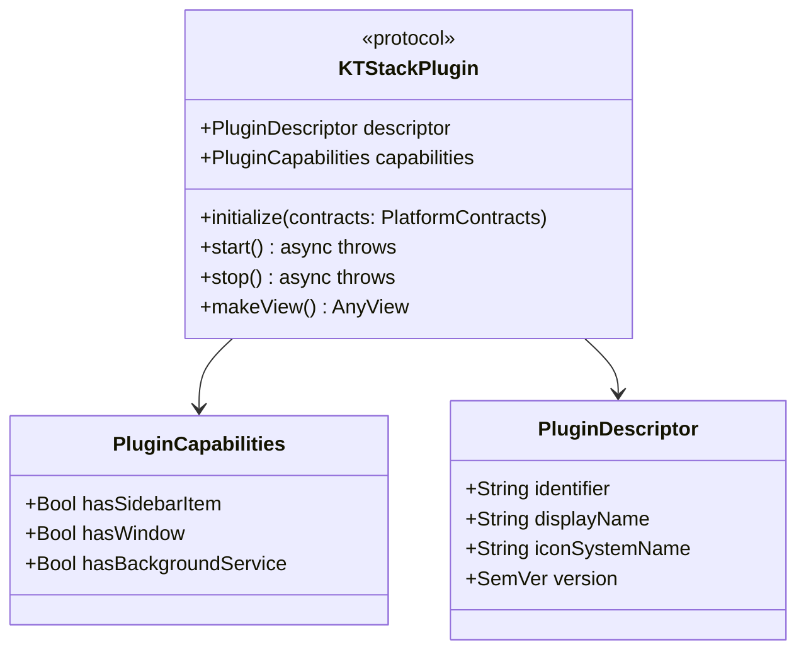

# 11. Specification Parity & Extension Points

[Previous: Current State & Technical Debt](10-current-state-and-debt.md) · [Index](README.md)

---

## 1. Feature Parity & Ecosystem Comparison

KTStack positions itself as an open-source, zero-dependency alternative to commercial local hosting environments:

| Feature Dimension | **KTStack** | Laravel Herd (macOS) | Laravel Valet | Laragon (Windows) |
|---|:---:|:---:|:---:|:---:|
| **License & Price** | **Free & MIT Open-Source** | Proprietary ($99/yr Pro) | Free (MIT) | Free (GPL) |
| **Native User Interface** | **Native Menu-Bar & Dashboard** | Native GUI | None (CLI only) | Native GUI |
| **Runtime Dependencies** | **Zero (Self-Contained)** | Zero (Self-Contained) | Homebrew Required | Pre-packaged |
| **Local Trusted TLS** | **Automatic (Local Root CA)** | Automatic (mkcert) | Automatic (mkcert) | Self-signed |
| **Multi-PHP Switching** | **PHP 7.4 → 8.5 Built-in** | PHP 7.4 → 8.4 (Pro) | Manual brew link | Dropdown switch |
| **Database Engines** | **Built-in (MySQL, PG, SQLite)**| Pro Tier Only | External Install | Built-in |
| **Built-in Database Editor**| **Built-in (Clean-Room MIT)** | None (Requires TablePlus) | None | HeidiSQL |
| **Mail Testing (Mailpit)** | **Built-in** | Pro Tier Only | None | Built-in (MailHog) |
| **Public Sharing (Tunnel)** | **Built-in (Cloudflare)** | Pro Tier Only | ngrok / Expose | ngrok integration |
| **Design Language** | **`SwiftUI + Liquid Glass + HIG`** | Standard AppKit/SwiftUI | N/A | Win32 / Delphi |

---

## 2. Plugin SDK Architecture (`KTPluginKit`)

KTStack is architected to allow functional extensions through modular plugins without recompiling platform core services:



### Plugin Extension Lifecycle:
1. **Discovery**: `PluginLifecycleCoordinator` instantiates registered plugin descriptors at application launch.
2. **Contract Injection**: Passes typed capability providers (`SiteProviding`, `ServiceProviding`) defined in `KTPlatformContracts`.
3. **View Rendering**: If `capabilities.hasWindow` is true, the app embeds the plugin's `makeView()` into a tabbed workspace window or dashboard card with design tokens (`KTPluginKit`).
4. **Graceful Teardown**: Upon application termination, asynchronous `stop()` hooks shut down child listeners, sockets, and timers.

---

## 3. Database Driver Extension Points (`KTDatabasePlugin`)

New database engines (e.g., ClickHouse, DuckDB, Redis) can be integrated by implementing the unified driver protocol:

```swift
public protocol KTDatabaseDriverProtocol: Sendable {
    func connect(configuration: KTConnectionConfig) async throws -> KTDatabaseConnection
    func fetchTableSchemas() async throws -> [KTTableSchema]
    func executeQuery(_ sql: String, parameters: [KTQueryParameter]) async throws -> KTQueryResult
    func executeTransaction(_ operations: [KTBatchOperation]) async throws
}
```

By conforming to this contract, any database engine automatically inherits:
- Focus-free table grid editing (`KTCellOverlayEditor`).
- Virtual scrolling with keyboard shortcuts (`KTGridKeyHandlingTableView`).
- Primary-key indexed staging and rollbacks (`KTGridStagingState`).

---

## 4. Future Architectural Horizons

1. **Multi-Language Runtime Expansion**: Extending shims and supervisors to support Python (WSGI/ASGI), Ruby (Puma), and Go applications alongside PHP and Node.js.
2. **Native Windows Architecture (Separate Codebase)**: Rather than cross-platform web wrappers (Electron), future Windows support will follow a separate native C# / WinUI 3 architecture sharing the same relocated binary concepts and wire specifications.
3. **Advanced Liquid Glass Refinements**: As macOS 27+ evolves, deeper adoption of glass morphing transitions across detail cards and database editor tools will be introduced while strictly maintaining the macOS 13+ compatibility fence.

---

[Previous: Current State & Technical Debt](10-current-state-and-debt.md) · [Index](README.md)
