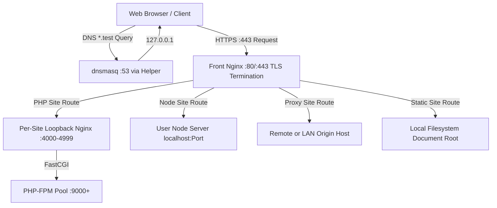

# KTStack — System Architecture & Technical Presentation

> **A Native macOS Local Development Environment for PHP & Node.js**  
> Comprehensive Architecture Blueprint, Layering Invariants, Subsystem Topologies, and Modern UI Standards.

---

## 1. Executive Summary & Product Vision

KTStack is a native macOS application engineered to replace multi-tool local development stacks (Docker, Laravel Herd, Laravel Valet, Laragon) with a unified, lightweight, zero-dependency environment.

```text
┌─────────────────────────────────────────────────────────────────────────────┐
│                                KTStack App                                  │
│                 Native SwiftUI Menu-Bar & Dashboard Manager                 │
│                                                                             │
│  • Automatic *.test Domains        • Trusted Local TLS (mkcert + CA)        │
│  • Nginx Dual-Tier Reverse Proxy   • PHP 7.4 → 8.5 (Relocated Bottles)      │
│  • Node.js 20/22/24/26 Proxies     • Built-in Multi-DB Editor (MIT Clean)   │
│  • Mailpit Mail Catcher            • Cloudflare Tunnel Instant Sharing      │
└──────────────────────────────────────┬──────────────────────────────────────┘
                                       │
                    ┌──────────────────┴──────────────────┐
                    ▼                                     ▼
        ┌───────────────────────┐             ┌───────────────────────┐
        │  Privileged Helper    │             │  User Launch Agents   │
        │  SMAppService / XPC   │             │  Non-Root Services    │
        │  • Port 53 (dnsmasq)  │             │  • Nginx (:80, :443)  │
        │  • /etc/resolver/test │             │  • PHP-FPM Pools      │
        │  • System Root CA     │             │  • Databases & Redis  │
        └───────────────────────┘             └───────────────────────┘
```

### Core Value Invariants
- **Zero Docker, Zero Homebrew Required**: Self-contained runtime architecture. Core binaries ship inside the app bundle; runtimes are vendored and isolated in `~/Library/Application Support/KTStack/`.
- **Clean-Room MIT Provenance**: 100% original code under the MIT license. Zero copy/adaptation from AGPL-3.0 or proprietary codebases.
- **Strict Separation of Privilege**: Root helper does strictly three tasks (port 53 DNS, `/etc/resolver/`, CA trust). Everything else runs under the user's unprivileged context.
- **Next-Gen UI**: Designed with **`SwiftUI + Liquid Glass + Apple HIG`**, offering backward-compatible support from macOS 13.0 to modern macOS 27+.

---

## 2. Global Request & Network Routing Topology

macOS restricts binding privileged ports (`:80`, `:443`, `:53`). KTStack solves this using a two-tier routing topology:



### Routing Subsystems
1. **Local DNS Resolution**:
   - Privileged helper writes `/etc/resolver/<tld>` (default `test`).
   - `dnsmasq` listens on `127.0.0.1:53`, resolving all `*.<tld>` queries to loopback.
2. **Front Reverse Proxy (TLS Termination)**:
   - Fixed Front Nginx binds `:80` and `:443`.
   - Terminates TLS using per-site leaf certificates minted by vendored `mkcert`.
   - Injects canonical proxy headers (`Host`, `X-Forwarded-For`, `X-Forwarded-Proto`, WebSocket upgrades).
3. **Per-Site Loopback Backends**:
   - Each active PHP site runs a lightweight backend on private loopback ports (4000–4999).
   - Pins `SERVER_PORT` and `HTTPS` to avoid framework redirection loops.
   - Communicates with the site's designated PHP-FPM pool via FastCGI.

---

## 3. Modular Package Architecture & Dependency Invariants

KTStack enforces a strict downward-only dependency hierarchy managed through Swift Package Manager and validated by CI scripts (`scripts/architecture-check.sh`):

```text
┌────────────────────────────────────────────────────────────────────────┐
│                              Main App                                  │
│             KTStack.app (Composition, Windowing, Wiring)               │
└────┬───────────────┬───────────────────────────┬───────────────────┬───┘
     │               │                           │                   │
     ▼               ▼                           ▼                   ▼
┌─────────┐   ┌─────────────┐             ┌─────────────┐     ┌─────────────┐
│ KTDumps │   │   KTMail    │   . . .     │  KTDoctor   │     │ KTDatabase  │
│ Feature │   │   Feature   │             │   Feature   │     │   Feature   │
└────┬────┘   └──────┬──────┘             └──────┬──────┘     └──────┬──────┘
     │               │                           │                   │
     └───────────────┼───────────────────────────┴───────────────────┘
                     ▼
         ┌───────────────────────┐
         │      KTPluginKit      │  ◄── Design Tokens, KT* Shared Components
         └───────────┬───────────┘
                     ▼
         ┌───────────────────────┐
         │  KTPlatformContracts  │  ◄── Service Capability Protocols
         └───────────┬───────────┘
                     ▼
         ┌───────────────────────┐
         │      KTStackCore      │  ◄── XPC Contract, Constants, Path Resolvers
         └───────────────────────┘
```

### Dependency Rules:
- **Feature Plugin ✗→ Feature Plugin**: Plugins never communicate directly. All cross-feature coordination is mediated by platform contracts.
- **Feature Plugin ✗→ KTStackKit**: Plugins depend only on `KTPlatformContracts`, `KTPluginKit`, and `KTStackCore`. They never import the internal platform implementation.
- **KTStackCore ✗→ UI/AppKit/SwiftUI**: `KTStackCore` contains no UI code, ensuring the privileged helper (which links Core) maintains an ultra-minimal attack surface.

---

## 4. UI Design Architecture: `SwiftUI + Liquid Glass + Apple HIG`

KTStack embraces Apple's next-generation **Liquid Glass** design language while preserving backward compatibility down to macOS 13.0 (Ventura).

### 4.1 Concept Distinction
- **Liquid Glass**: The optical material and dynamic design language of macOS 27+ / iOS 27+, characterized by environmental light reflection, real-time backdrop blur, fluid boundary physics, and state-driven morphing.
- **SwiftUI**: The declarative framework used to build and animate native views.
- **Discipline**: Never refer to native macOS UI as generic "glassmorphism" (static CSS blur filters). The standard keyword is **`SwiftUI + Liquid Glass + Apple HIG`**.

### 4.2 Native Liquid Glass APIs
```swift
// Single interactive surface
Text(site.name)
    .font(.headline)
    .padding(.horizontal, 14)
    .padding(.vertical, 8)
    .glassEffect(.regular.interactive(), in: .rect(cornerRadius: 10))

// Multi-element optical grouping (single-pass compositor batching)
GlassEffectContainer(spacing: 16) {
    HStack(spacing: 12) {
        Button("Start") { }
            .buttonStyle(.glass)
        Button("Restart") { }
            .buttonStyle(.glassProminent)
    }
}
```

### 4.3 Modifier Ordering & Availability Architecture
1. **Modifier Order**: Framing, padding, and layout modifiers MUST be declared **before** `.glassEffect(...)`.
2. **Backward Compatibility Guard**:
```swift
if #available(macOS 27, *) {
    content
        .padding()
        .glassEffect(.regular, in: .rect(cornerRadius: KTRadius.card))
} else {
    content
        .padding()
        .background(.ultraThinMaterial, in: RoundedRectangle(cornerRadius: KTRadius.card))
}
```
3. **Performance Guardrail**: Never apply `.glassEffect()` per cell or per row in dense virtualized data tables or log streams. Reserve glass materials for window chrome, sidebars, floating controls, and modal cards.

---

## 5. Subsystem Deep-Dives

### 5.1 Database Editor Grid (`KTDatabasePlugin`)
Built clean-room under MIT license, replacing default AppKit table limitations:
- **`KTCellOverlayEditor`**: A floating `NSTextView` positioned dynamically over the edited cell, bypassing `NSTextFieldDelegate` focus trapping and preserving full keyboard navigation (`Tab`, `Shift+Tab`, `Return`, `Esc`).
- **`KTGridKeyHandlingTableView`**: Custom `NSTableView` intercepting key events prior to standard dispatch, unlocking instant type-to-edit, row insertion (`⌘N`), deletion, and staging commits (`⌘S`).
- **`StagedTableEditor`**: Changes, dirty cells, and draft rows are indexed strictly by **primary key (PK)** rather than volatile row indexes, guaranteeing consistency during virtual scrolling, sorting, and pagination.
- **Driver Transaction Parity**: Atomic transaction support across MySQL, PostgreSQL (`$1, $2` parameterized queries), and SQLite (`BEGIN IMMEDIATE TRANSACTION`).

### 5.2 Local TLS & macOS Root CA Trust Subsystem
- **Privileged Certificate Installation**: Root CA is installed via privileged helper executing `security add-trusted-cert` with `-p ssl -p basic` flags to explicitly configure `sslServer` and `basicX509` policy OIDs.
- **Native Trust Evaluation**: Avoids CLI false positives (`security find-certificate`) by querying native `Security.framework` APIs (`SecTrustSettingsCopyTrustSettings`, `SecTrustEvaluateWithError`).

### 5.3 PHP & Node.js Runtime Engine
- **Relocated Bottles**: PHP 7.4 through 8.5 are delivered as relocated bottles with non-system dylibs rewritten via `@loader_path/../lib`, completely isolated from Homebrew.
- **Dynamic Extensions**: Full support for shared extensions (`redis.so`, `xdebug.so`, `imagick.so`) configured via user-editable `php.ini`.
- **Site Runtime Pins**: Site directories automatically link terminal PHP versions to their web-serving pool.

---

## 6. Active Agent Skills Triad

Development and AI-assisted maintenance in KTStack are governed by three primary skills:

| Skill | Source | Primary Responsibility |
|---|---|---|
| **`swiftui-pro`** | `twostraws/swiftui-agent-skill` | SwiftUI architecture, modern APIs, Apple HIG, data flow, navigation, and hygiene. |
| **`swiftui-liquid-glass`** | `Dimillian/Skills` | Native Liquid Glass implementation, `.glassEffect()`, `GlassEffectContainer`, glass button styles, and fallbacks. |
| **`swiftui-performance-audit`** | `Dimillian/Skills` | Invalidation storms, render thrash, CPU/memory profiling, and Instruments guidance. |

---

## 7. Verification & Engineering Lifecycle

```bash
# 1. Regenerate Xcode project from project.yml specification
xcodegen generate

# 2. Run architecture dependency boundaries verification
scripts/architecture-check.sh

# 3. Run unit and framework logic tests
xcodebuild -project KTStack.xcodeproj -scheme KTStackKit-Tests -destination 'platform=macOS' test

# 4. Execute quick local gate (linting + tests)
scripts/ci-local.sh --quick

# 5. Execute integration verification against real local daemons
scripts/integration-test.sh
```
